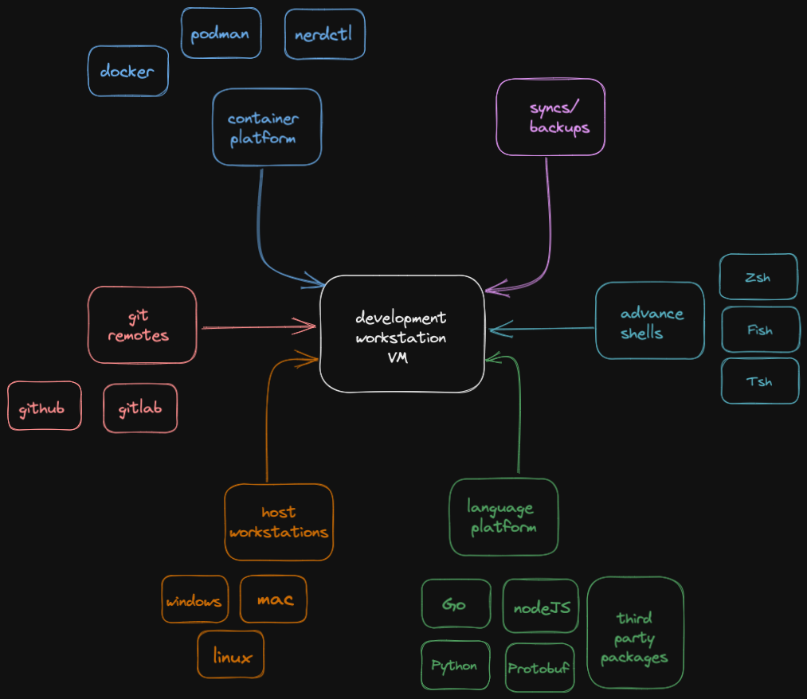

# Mind Palace
One stop solution for your developer environment

* Configure your development enviroment with a yaml and effortlessly deploy your vm on local or cloud along with your fav IDE, tools and plugins
* Centralise your teams developement environment at one place with consistent tooling
* Share your environment with your teammates
* Secure your environment with SSL and password


[Diagram](./diagram.png) 

Install git and clone this [repo](https://github.com/pranaySinghDev/mind-palace)

## Repo structure
- Readme.md
- vangrantfile
    * The entry point where all the components stich together, thats where you should start readning the code first.
- .env 
- config
    * base config
    * config_local.yaml: The main configurational file, to create your custom environment according to your needs.
- hosts
    * basic host program installations for mac, windows and linux
- platforms
    * coding language and tools installation folder (go, nodejs, java etc)


## Configuration files

1.config.yaml : base config to get you started (Will be commited to git)
```
    vagrant_box: "bento/ubuntu-20.04" # Currently scripts supports ubuntu distribution only
```

2.config_local.yaml : your custom config which will be merged with base config (Upto you if you want to commit)
 ```yaml
    guest_name: "<name-of-host-machine>"
    guest_user: "<user-name>"
    memory : 2048 # According to your need
    cpus: 2 # According to your need
    sync_folder: 
    - host: "<folder-path-of-host-machine-to-sync>"
      guest: "<folder-path-of-guest-machine-to-be-in-sync>"
    git_repo:
    - "repo-1" #This will go into workspace folder
    - "repo-n"
    port_forward: #List of ports to forward from guest to host
    - host: 8080 #To run vscode on host
      guest: 8080
    - host: 9090 #To monitor vm health
      guest: 9090
    shell: "fish" #you can choose from ["zsh" "fish"]
    lang:
    - "go"
    - "node"
    - "protobuf"
    IDE: # hosts your version of vscode on this vm 
    - "vscode"
    code_exts: # extension to be installed on vscode server
    - akamud.vscode-theme-onedark
    - golang.go
    - tinkertrain.theme-panda 
    - eamodio.gitlens
    - esbenp.prettier-vscode
    - zxh404.vscode-proto3
    - coenraads.bracket-pair-colorizer
    - oderwat.indent-rainbow
    - redhat.vscode-yaml
    - editorconfig.editorconfig

```

3.env : Your local env file not to be pushed. Not to be committed (Sensetive tokens like github developer token will be stored here)

Must have: `token=<github-developer-token>`

```bash
token=<github-developer-token>
```

Read [this](https://docs.github.com/en/authentication/keeping-your-account-and-data-secure/creating-a-personal-access-token) doc to generate github developer token, exporting github tokens will allow you to install your private gopackages as well

## Setup
* Update the values in the `config_local.yaml` file 
* Run host machine scripts, this will install your browser, vagrant and machine images
* Run `vagrant up --provison`, to provision your development environment
* Accessing your environment
    * ssh into it `vagrant ssh` or You can go to browser on your host machine and open url 
    * `localhost:8080` to open vscode
    * `localhost:9090` to open [cockpit](https://cockpit-project.org/) dashboard
* Run `vagrant halt` when you want to power off your machine
* Run `vagrant suspend` when you want to hibernate your machine
* Run `vagrant destroy` when you want to remove the vm


### Connect to vagrant via host vscode (Alternate)
Remove the IDE yaml config to skip code-server installation, Alternatively you can install vscode on host and connect via ssh, read this doc, [connect to vscode with ssh](https://medium.com/@lizrice/ssh-to-vagrant-from-vscode-5b2c5996bc0e#:~:text=Connect%20VScode%20to%20the%20machine,view%20and%20edit%20inside%20VScode)


## Features
* Yaml configurable vagrant provisioning with .env support 
* Host environment setup
    - [X] Brew
    - [X] Vscode and its extensions
    - [X] Brave
    - [X] Virtual box
    - [X] Vagrant 
    - [X] Vagrant boxes
    - [X] Postman
    - [X] Spotify


* Guest development environment setup
    - [X] Install ubuntu
    - [X] Install Golang
    - [X] Install git and setup git access
    - [X] Clone the repos
    - [X] Install docker
    - [X] Install advance shell with themes
    - [X] Install code server (your locally managed vscode)
    - [X] Install proto dependencies
    - [X] Install godotenv
    - [ ] Install drive and sync personal folder
    - [ ] Setup startup apps 
    - [ ] Adding GCP creds and cli
    - [ ] Adding AWS creds and cli 
    - [ ] Add backup before vagrant destroy trigger 
    - [ ] Share your environment via ssh
